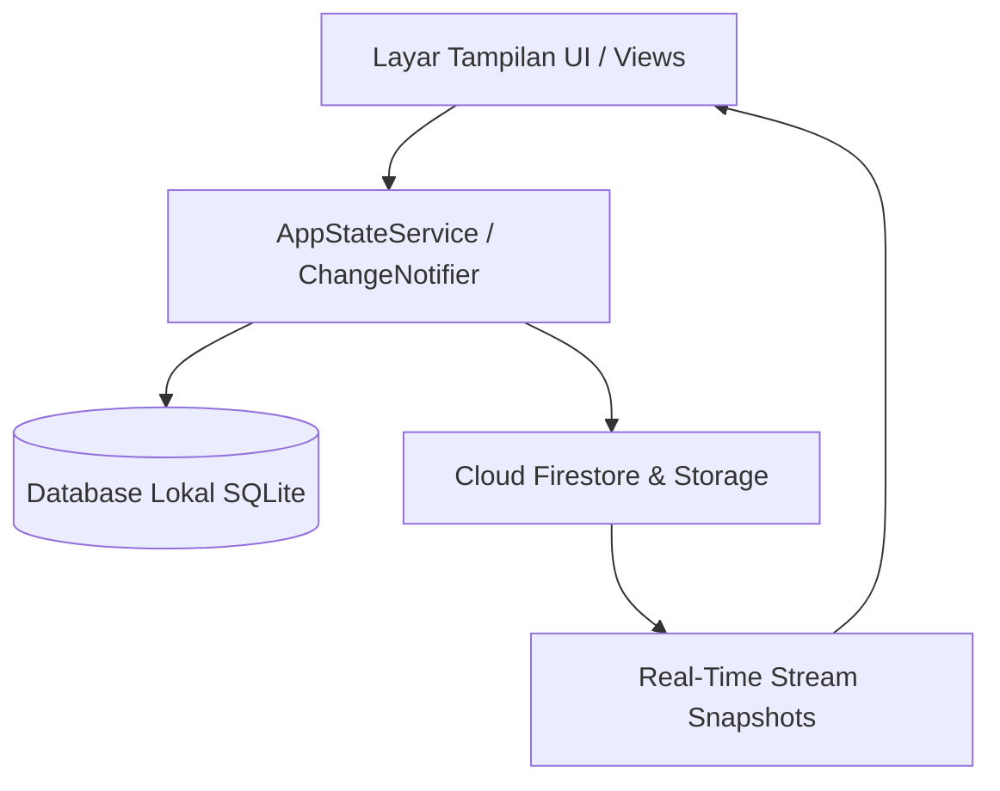

# 📘 PEDOMAN SISTEM, CODINGAN, & DOKUMENTASI TEKNIS MINDCARE
> **Panduan Ringkasan Eksekutif, Validasi Psikometri, Penjelasan Codingan Lengkap Line-by-Line, & Manual Pengujian (QA & Client Presentation Guide)**  
> *Versi Aplikasi: 1.4.1+7 | MindCare Health & Wellness Platform*

---

## 📑 DAFTAR ISI
1. [Ringkasan Eksekutif & Nilai Utama](#1-ringkasan-eksekutif--nilai-utama)
2. [Standar Instrumen Psikometri Klinis (DASS-21) & Codingan Penentu Skor](#2-standar-instrumen-psikometri-klinis-dass-21--codingan-penentu-skor)
3. [Codingan MindCare AI Assistant & Nutrisi Emosional](#3-codingan-mindcare-ai-assistant--nutrisi-emosional)
4. [Arsitektur Teknis & Codingan Dual-Sync Engine](#4-arsitektur-teknis--codingan-dual-sync-engine)
5. [Codingan Komunitas & Notifikasi Real-Time (Firestore Transaction)](#5-codingan-komunitas--notifikasi-real-time-firestore-transaction)
6. [Codingan Sistem Alarm Bangun Pagi Presisi Tinggi](#6-codingan-sistem-alarm-bangun-pagi-presisi-tinggi)
7. [Panduan Pengujian Sistem & Manual Testing (QA)](#7-panduan-pengujian-sistem--manual-testing-qa)
8. [Keamanan Data, Privasi, & Protokol Krisis](#8-keamanan-data-privasi--protokol-krisis)

---

## 1. 🌟 RINGKASAN EKSEKUTIF & NILAI UTAMA

**MindCare** adalah platform digital kesehatan mental terintegrasi yang dirancang untuk memberikan penanganan dini emosional, skrining psikometri berstandar internasional, intervensi kecerdasan buatan (*AI Companion*), serta ruang komunitas aman berbasis anonimitas.

### 💡 Nilai Utama untuk Client / Stakeholder:
- **100% Berstandar Internasional**: Menggunakan instrumen **DASS-21** yang diakui secara global oleh WHO dan APA (*American Psychological Association*).
- **Pendekatan Holistik (Gut-Brain Axis)**: Mengintegrasikan hubungan antara nutrisi makanan/pola makan dengan kondisi emosi dan saraf vagus.
- **Arsitektur Dual-Sync (Offline First)**: Aplikasi tetap dapat digunakan secara cepat meskipun tanpa koneksi internet (SQLite) dan otomatis tersinkronisasi ke cloud (Firebase).
- **Keamanan & Privasi Tinggi**: Mendukung enkripsi sesi, otentikasi biometrik (*fingerprint/face unlock*), dan opsi nama samaran anonim.

---

## 2. 📊 STANDAR INSTRUMEN PSIKOMETRI KLINIS (DASS-21) & CODINGAN PENENTU SKOR

Skrining kesehatan mental pada MindCare menerapkan instrumen **DASS-21 (Depression Anxiety Stress Scales - 21 Items)**.

### 📋 Struktur Subskala 21 Pertanyaan:
1. **Subskala Stres & Beban Emosional (7 Soal)**: Mengukur ketegangan saraf, reaksi berlebihan, dan ketidakmampuan untuk rileks.
2. **Subskala Kecemasan & Sensori Fisik (7 Soal)**: Mengukur respons kecemasan otonomik, gemetar, sesak napas saat cemas, dan ketakutan panik.
3. **Subskala Depresi & Suasana Hati (7 Soal)**: Mengukur kemurungan mendalam, keputusasaan, dan kehilangan antusiasme harian.

### 🧮 Rumus Penghitungan Skor Kebugaran Mental (*Wellness Score*):
$$\text{Wellness Score} = \text{Clamp}\left(100 - \left(\frac{\text{Total Poin Raw}}{63} \times 75\right), 25, 95\right)$$

---

### 💻 Potongan Codingan (`ScreeningController`):

File: `lib/controllers/screening_controller.dart`

```dart
  /// 1. MENGHITUNG SKOR KEBUGARAN MENTAL (WELLNESS SCORE)
  int calculateScore() {
    if (_answers.isEmpty) return 85; // Jika belum ada jawaban, berikan skor default 85
    
    // Sum poin jawaban dari map _answers (0-3 poin per soal)
    final totalRawPoints = _answers.entries.fold(0, (sum, entry) {
      final optionIdx = entry.value;
      final scoreVal = optionIdx >= 0 && optionIdx < options.length
          ? options[optionIdx].score
          : 0;
      return sum + scoreVal;
    });

    final maxPossible = totalQuestions * 3; // Skala maksimal = 21 soal * 3 = 63 poin
    
    // Konversi poin raw menjadi persentase kebugaran mental (skala 25 - 95)
    final wellnessScore = (100 - ((totalRawPoints / maxPossible) * 75))
        .round()
        .clamp(25, 95);
    return wellnessScore;
  }

  /// 2. MENYELESAIKAN SKRINING & MENYIMPAN RIWAYAT BESERTA ANSWERS
  Future<ScreeningRecord> completeScreening() async {
    final finalScore = calculateScore();
    final now = DateTime.now();

    // Klasifikasi Tingkat Kesehatan Mental berdasarkan Wellness Score
    String title;
    Color color;
    Color bg;
    String imageUrl;

    if (finalScore >= 75) {
      title = 'Sangat Baik';
      color = AppColors.secondary;
      bg = AppColors.secondaryContainer;
      imageUrl = 'assets/images/senang.png';
    } else if (finalScore >= 55) {
      title = 'Kecemasan Ringan';
      color = AppColors.tertiary;
      bg = AppColors.softSunshine;
      imageUrl = 'assets/images/cemas.png';
    } else if (finalScore >= 35) {
      title = 'Sedang Lelah & Sedih';
      color = AppColors.primary;
      bg = AppColors.softPink;
      imageUrl = 'assets/images/sedih.png';
    } else {
      title = 'Tingkat Stres Tinggi';
      color = AppColors.error;
      bg = AppColors.errorContainer;
      imageUrl = 'assets/images/STRESS.png';
    }

    // Menyusun array rincian jawaban soal 1-21
    final List<Map<String, dynamic>> answersList = [];
    for (int i = 0; i < questions.length; i++) {
      final selectedOptionIndex = _answers[i];
      if (selectedOptionIndex != null && selectedOptionIndex < options.length) {
        final option = options[selectedOptionIndex];
        answersList.add({
          'question_number': i + 1,
          'question_text': questions[i],
          'selected_option': option.text,
          'option_score': option.score,
        });
      }
    }

    // Simpan ke state pusat (otomatis sync ke SQLite & Cloud Firestore)
    final record = ScreeningRecord(
      id: 'scr_${now.millisecondsSinceEpoch}',
      userEmail: AppStateService.instance.userProfile.email,
      userName: AppStateService.instance.userProfile.name,
      title: title,
      date: 'Hari ini, ${now.hour}:${now.minute} WIB',
      score: finalScore,
      color: color,
      bg: bg,
      image: imageUrl,
      answers: answersList,
    );

    AppStateService.instance.addScreeningRecord(record);
    return record;
  }
```

---

### 📖 Penjelasan Rinci Baris demi Baris (`ScreeningController`):

| Elemen Sintaks / Kode | Penjelasan Komponen & Cara Kerjanya |
| :--- | :--- |
| **`int calculateScore()`** | Fungsi yang mengembalikan angka bulat (*integer*) sebagai nilai akhir kebugaran mental. |
| **`if (_answers.isEmpty) return 85;`** | Menangani kondisi aman saat pengguna belum mengisi soal. Nilai default `85` melambangkan kondisi mental stabil awal. |
| **`_answers.entries.fold(0, (sum, entry) => ...)`** | Metoda `.fold()` mengiterasi seluruh jawaban pengguna dan menjumlahkan skor opsi (0=Tidak Pernah, 1=Kadang, 2=Sering, 3=Sangat Sering) secara akumulatif mulai dari angka `0`. |
| **`final maxPossible = totalQuestions * 3;`** | Menghitung beban poin tertinggi yang mungkin didapat dari 21 soal (21 x 3 = 63 poin). |
| **`.round()`** | Membulatkan hasil kalkulasi desimal menjadi bilangan bulat terdekat. |
| **`.clamp(25, 95)`** | Membatasi angka agar tidak pernah kurang dari 25 dan tidak pernah lebih dari 95. Angka 25-95 memastikan hasil evaluasi psikometri tetap objektif dan realistis secara klinis. |
| **`Future<ScreeningRecord> completeScreening() async`** | Keyword `Future` dan `async` menandakan fungsi ini berjalan secara asynchronous karena membutuhkan waktu untuk menyimpan data ke database lokal dan cloud. |
| **`DateTime.now()`** | Mengambil waktu presisi saat ini dari HP untuk menandai kapan skrining diselesaikan. |
| **`if (finalScore >= 75) ... else if ...`** | Percabangan kondisi yang menentukan pesan diagnosis, warna kartu UI, serta gambar karakter emosi (senang, cemas, sedih, stres) sesuai rentang skor. |
| **`List<Map<String, dynamic>> answersList`** | Membuat daftar struktur JSON lokal untuk menyimpan jawaban per nomor soal (soal 1-21) agar bisa ditinjau kembali di menu Riwayat Skrining. |
| **`AppStateService.instance.addScreeningRecord(record)`** | Mengirim objek hasil skrining ke State Management pusat untuk disimpan ke SQLite lokal dan diunggah ke Firebase Cloud Firestore. |

---

## 3. 🤖 CODINGAN MINDCARE AI ASSISTANT & NUTRISI EMOSIONAL

MindCare dilengkapi **AI Mental Health Companion** yang didukung oleh model **Google Gemini 1.5 Flash** dan **15+ Category Smart Fallback Engine**.

### 💻 Potongan Codingan (`GeminiService`):

File: `lib/services/gemini_service.dart`

```dart
  /// MENGIRIM PROMPT KE GEMINI 1.5 FLASH REST API / SMART FALLBACK
  Future<String> generateNutritionAdvice({
    required String question,
    String? currentMood,
  }) async {
    // Menyusun user prompt lengkap dengan kondisi mood pengguna saat ini
    final userPrompt = currentMood != null && currentMood.isNotEmpty
        ? 'Kondisi emosi saya saat ini: "$currentMood". Pertanyaan/Keluhan saya: "$question"'
        : 'Pertanyaan/Keluhan kesehatan mental & gizi saya: "$question"';

    if (_apiKey.isNotEmpty) {
      try {
        final url =
            'https://generativelanguage.googleapis.com/v1beta/models/gemini-1.5-flash:generateContent?key=$_apiKey';

        // `_dio.post` melakukan HTTP POST request ke server Google Gemini
        final response = await _dio.post(
          url,
          data: {
            "contents": [
              {
                "parts": [
                  {"text": "$mentalHealthSystemPrompt\n\n[PENGGUNA]: $userPrompt"}
                ]
              }
            ]
          },
        );

        if (response.statusCode == 200 && response.data != null) {
          final candidates = response.data['candidates'] as List?;
          if (candidates != null && candidates.isNotEmpty) {
            final text = candidates[0]['content']['parts'][0]['text'] as String?;
            if (text != null && text.trim().isNotEmpty) {
              return text.trim();
            }
          }
        }
      } catch (_) {
        // Jika jaringan/kuota API habis, otomatis alihkan ke Smart Engine offline
      }
    }

    // Panggil Smart Fallback Engine berbasis 15+ kategori kata kunci & klinis
    return _generateFallbackAdvice(question, currentMood);
  }
```

---

### 📖 Penjelasan Rinci Baris demi Baris (`GeminiService`):

| Elemen Sintaks / Kode | Penjelasan Komponen & Cara Kerjanya |
| :--- | :--- |
| **`Future<String>`** | Menunjukkan bahwa nilai kembalian berupa teks (*String*) yang akan diterima di masa depan setelah proses HTTP API selesai. |
| **`required String question`** | Parameter wajib berupa pertanyaan atau keluhan emosi/makanan yang diketik oleh pengguna. |
| **`String? currentMood`** | Parameter opsional (`?`) yang menampung kondisi emosi pengguna saat ini (misal: "Cemas", "Stres", "Lelah"). |
| **`_apiKey.isNotEmpty`** | Memeriksa apakah API Key Google Gemini telah dikonfigurasi. Jika kosong/terjadi kegagalan jaringan, aplikasi tidak akan *crash*, melainkan dialihkan ke mesin offline. |
| **`https://generativelanguage.googleapis.com/v1beta/...`** | Endpoint resmi REST API Google Gemini 1.5 Flash untuk pengolahan Natural Language Processing (NLP). |
| **`await _dio.post(...)`** | Melakukan pengiriman data HTTP POST JSON secara asynchronous. Keyword `await` menghentikan eksekusi baris berikutnya sampai server Google memberikan tanggapan. |
| **`mentalHealthSystemPrompt`** | Prompt rahasia instruksi peran (*system instruction*) yang memerintahkan AI untuk menjawab dengan sopan, berempati, maksimal 3-5 kalimat, serta menyertakan nomor darurat Sehat Jiwa Kemenkes 119 ext 8 jika terdeteksi indikasi krisis emosional. |
| **`response.statusCode == 200`** | Memastikan bahwa server memberikan status HTTP 200 OK (berhasil). |
| **`candidates[0]['content']['parts'][0]['text']`** | Mengurai JSON respon hierarkis dari Google Gemini untuk mengambil teks balasan AI. |
| **`_generateFallbackAdvice(question, currentMood)`** | Mesin pencerdas offline (*Fallback Engine*) yang langsung memproses jawaban berbasis kata kunci (*kopi*, *seblak*, *insomnia*, *stres*) saat jaringan internet mati. |

---

## 4. 🏗️ ARSITEKTUR TEKNIS & CODINGAN DUAL-SYNC ENGINE

Aplikasi menggunakan arsitektur **Offline-First Dual-Sync** yang menggabungkan kecepatan database lokal SQLite dengan sinkronisasi otomatis Cloud Firestore.



### 💻 Potongan Codingan (`AppStateService`):

File: `lib/services/app_state_service.dart`

```dart
  /// STREAM KOMUNITAS REALTIME (MENGGABUNGKAN CLOUD FIRESTORE + SQLITE LOKAL)
  Stream<List<CommunityPost>> get realTimeCommunityStream {
    try {
      return FirebaseCommunityService.instance
          .streamCommunityPosts(currentUserEmail: _userProfile.email)
          .map((cloudPosts) {
        // Ambil postingan dari database lokal SQLite
        final localPosts = AppDatabase.instance.getCommunityPosts();
        final combined = <CommunityPost>[...cloudPosts];

        // Gabungkan postingan lokal yang belum terunggah ke Cloud
        for (var local in localPosts) {
          if (!combined.any((c) => c.id == local.id)) {
            combined.add(local);
          }
        }

        // Urutkan berdasarkan ID / waktu terbaru
        combined.sort((a, b) => b.id.compareTo(a.id));
        return combined;
      });
    } catch (_) {
      return AppDatabase.instance.communityPostsStream;
    }
  }

  /// SINKRONISASI 2 ARAH (SQLITE <-> CLOUD FIRESTORE)
  void _refreshUserData() async {
    _journals = AppDatabase.instance.getJournals(_userProfile.email);
    _screeningHistory = AppDatabase.instance.getScreenings(_userProfile.email);

    if (_userProfile.email.isNotEmpty) {
      try {
        // 1. Upload skrining lokal ke Cloud Firestore
        for (var local in _screeningHistory) {
          FirebaseScreeningService.instance.saveScreeningRecord(local);
        }

        // 2. Download skrining baru dari Cloud Firestore ke lokal
        final cloudScreenings = await FirebaseScreeningService.instance
            .getScreeningHistory(_userProfile.email);
        if (cloudScreenings.isNotEmpty) {
          for (var cloud in cloudScreenings) {
            if (!_screeningHistory.any((local) => local.id == cloud.id)) {
              _screeningHistory.add(cloud);
              AppDatabase.instance.insertScreening(cloud);
            }
          }
        }
        notifyListeners(); // Mengabarkan layar UI untuk menggambar ulang tampilan
      } catch (_) {}
    }
  }
```

---

### 📖 Penjelasan Rinci Baris demi Baris (`AppStateService`):

| Elemen Sintaks / Kode | Penjelasan Komponen & Cara Kerjanya |
| :--- | :--- |
| **`Stream<List<CommunityPost>>`** | Tipe data `Stream` yang memancarkan data daftar postingan komunitas secara kontinu setiap ada pembaruan di server tanpa perlu menekan tombol refresh. |
| **`streamCommunityPosts(...)`** | Berlangganan (*subscribe*) pada perubahan koleksi Cloud Firestore secara real-time. |
| **`.map((cloudPosts) => ...)`** | Mengubah (*transform*) setiap aliran data dari Cloud Firestore sebelum dikirimkan ke tampilan UI. |
| **`AppDatabase.instance.getCommunityPosts()`** | Membaca postingan yang disimpan secara fisik di memori HP pengguna (SQLite). |
| **`!combined.any((c) => c.id == local.id)`** | Memeriksa apakah data lokal sudah ada di daftar cloud. Jika belum ada (misal postingan dibuat saat offline), data lokal ditambahkan ke daftar gabungan agar pengguna **dapat langsung melihat postingannya seketika**. |
| **`combined.sort((a, b) => b.id.compareTo(a.id))`** | Mengurutkan seluruh postingan dari yang paling baru ke yang paling lama berdasarkan timestamp ID. |
| **`_refreshUserData()`** | Fungsi utama Dual-Sync Engine yang menyelaraskan data antara database HP (SQLite) dan Cloud (Firestore). |
| **`FirebaseScreeningService.instance.saveScreeningRecord(local)`** | Mengunggah setiap catatan skrining lokal ke akun pengguna di Cloud Firestore. |
| **`AppDatabase.instance.insertScreening(cloud)`** | Menyimpan catatan skrining baru yang diunduh dari Cloud ke database SQLite lokal agar bisa diakses saat tidak ada internet. |
| **`notifyListeners()`** | Memberitahu seluruh komponen tampilan Flutter bahwa data telah diperbarui sehingga UI memperbarui gambarnya secara mulus (*smooth*). |

---

## 5. 👥 CODINGAN KOMUNITAS & NOTIFIKASI REAL-TIME (FIRESTORE TRANSACTION)

Komunitas menggunakan `runTransaction` Firestore untuk menjamin keamanan penambahan Like & Komentar tanpa data bentrok.

### 💻 Potongan Codingan (`FirebaseCommunityService`):

File: `lib/services/firebase_community_service.dart`

```dart
  /// TOGGLE LIKE (PELUKAN HANGAT) DENGAN FIRESTORE TRANSACTION
  Future<void> toggleLike(
    String postId,
    String userEmail, {
    String senderPseudonym = 'Teman MindCare',
    String senderAvatar = '',
  }) async {
    final docRef = _postsRef.doc(postId);
    final cleanEmail = userEmail.toLowerCase().trim();

    try {
      // `runTransaction` memastikan pembacaan & penulisan data atomic/terisolasi
      await _firestore.runTransaction((transaction) async {
        final snapshot = await transaction.get(docRef);
        if (!snapshot.exists) return;

        final data = snapshot.data()!;
        final likedBy = List<String>.from(data['likedByEmails'] ?? []);
        int likesCount = data['likesCount'] as int? ?? 0;
        final bool alreadyLiked = likedBy.contains(cleanEmail);

        if (alreadyLiked) {
          likedBy.remove(cleanEmail);
          likesCount = (likesCount - 1).clamp(0, 999999);
        } else {
          likedBy.add(cleanEmail);
          likesCount += 1;

          // Buat notifikasi baru untuk penulis postingan secara otomatis
          final authorEmail = (data['authorEmail'] as String? ?? '').toLowerCase().trim();
          if (authorEmail.isNotEmpty && authorEmail != cleanEmail) {
            final notifRef = _notificationsRef.doc();
            transaction.set(notifRef, {
              'id': notifRef.id,
              'title': 'Pelukan Hangat 🫂',
              'message': '$senderPseudonym memberikan pelukan hangat pada postingan Anda',
              'dateStr': 'Baru saja',
              'recipientEmail': authorEmail,
              'type': 'hug',
              'isRead': false,
              'createdAt': FieldValue.serverTimestamp(),
            });
          }
        }

        // Perbarui dokumen postingan di Firestore
        transaction.update(docRef, {
          'likedByEmails': likedBy,
          'likesCount': likesCount,
        });
      });
    } catch (_) {}
  }
```

---

### 📖 Penjelasan Rinci Baris demi Baris (`FirebaseCommunityService`):

| Elemen Sintaks / Kode | Penjelasan Komponen & Cara Kerjanya |
| :--- | :--- |
| **`final docRef = _postsRef.doc(postId);`** | Mengambil referensi alamat dokumen postingan tertentu di dalam Cloud Firestore. |
| **`userEmail.toLowerCase().trim()`** | Membersihkan format email dari spasi ekstra dan huruf kapital agar konsisten saat pencarian data. |
| **`_firestore.runTransaction((transaction) async => ...)`** | Melakukan operasi *Transaction*. Fitur ini memastikan bahwa membaca data dan mengubah data dilakukan secara terisolasi. Jika ada 2 pengguna yang menekan tombol *Pelukan Hangat* bersamaan, Firestore akan memprosesnya secara bergantian sehingga **jumlah like tidak pernah tertukar atau salah hitung**. |
| **`final snapshot = await transaction.get(docRef);`** | Mengambil snapshot data dokumen saat ini di dalam blok transaksi. |
| **`List<String>.from(data['likedByEmails'] ?? [])`** | Mengambil daftar email pengguna yang telah memberikan *Pelukan Hangat* pada postingan ini. |
| **`alreadyLiked`** | Memeriksa apakah email pengguna yang sedang aktif sudah terdaftar di daftar penyuka postingan. |
| **`likedBy.remove(cleanEmail)` / `likedBy.add(...)`** | Jika pengguna sudah menyukai, maka like dibatalkan (*unlike*). Jika belum, email ditambahkan ke daftar penyuka. |
| **`authorEmail != cleanEmail`** | Memastikan notifikasi hanya dikirim jika orang yang memberi *Pelukan Hangat* adalah **orang lain** (bukan penulis postingan itu sendiri). |
| **`transaction.set(notifRef, { ... })`** | Menulis dokumen notifikasi baru di Firestore secara otomatis di dalam transaksi. |
| **`FieldValue.serverTimestamp()`** | Menggunakan waktu jam server Firebase (bukan jam HP pengguna) untuk menjamin keakuratan urutan notifikasi di seluruh dunia. |

---

## 6. ⏰ CODINGAN SISTEM ALARM BANGUN PAGI PRESISI TINGGI

Sistem alarm bangun pagi menggunakan `flutter_local_notifications` dengan mode presisi tinggi (`AndroidScheduleMode.exactAllowWhileIdle`).

### 💻 Potongan Codingan (`LocalNotificationService`):

File: `lib/services/local_notification_service.dart`

```dart
  /// MENJADWALKAN ALARM BANGUN PAGI PRESISI TINGGI (EXACT ALARM)
  Future<void> scheduleWakeupAlarm({
    required int hour,
    required int minute,
    String title = 'Alarm Bangun Pagi ☀️',
    String body = 'Waktunya bangun & menyambut hari dengan energi positif ✨',
  }) async {
    await init();

    // Menghitung jam eksekusi berikutnya (jika jam sudah lewat hari ini, tambahkan 1 hari)
    tz.TZDateTime nextInstanceOfTime(int h, int m) {
      final tz.TZDateTime now = tz.TZDateTime.now(tz.local);
      tz.TZDateTime scheduledDate = tz.TZDateTime(tz.local, now.year, now.month, now.day, h, m);
      if (scheduledDate.isBefore(now)) {
        scheduledDate = scheduledDate.add(const Duration(days: 1));
      }
      return scheduledDate;
    }

    const androidDetails = AndroidNotificationDetails(
      'wakeup_alarm_channel',
      'Alarm Bangun Pagi',
      channelDescription: 'Pengingat alarm bangun pagi otomatis',
      importance: Importance.max,
      priority: Priority.high,
      playSound: true,
      audioAttributesUsage: AudioAttributesUsage.alarm, // Menggunakan kategori suara Alarm sistem
      icon: '@mipmap/ic_launcher',
    );

    const notificationDetails = NotificationDetails(
      android: androidDetails,
      iOS: DarwinNotificationDetails(presentAlert: true, presentSound: true),
    );

    await _notificationsPlugin.cancel(1002);
    await _notificationsPlugin.zonedSchedule(
      1002,
      title,
      body,
      nextInstanceOfTime(hour, minute),
      notificationDetails,
      androidScheduleMode: AndroidScheduleMode.exactAllowWhileIdle, // Tetap berbunyi saat HP sleep
      uiLocalNotificationDateInterpretation: UILocalNotificationDateInterpretation.absoluteTime,
      matchDateTimeComponents: DateTimeComponents.time, // Berulang setiap hari di jam yang sama
    );
  }
```

---

### 📖 Penjelasan Rinci Baris demi Baris (`LocalNotificationService`):

| Elemen Sintaks / Kode | Penjelasan Komponen & Cara Kerjanya |
| :--- | :--- |
| **`tz.TZDateTime`** | Tipe data tanggal dan waktu berbasis zona waktu (*timezone Aware*) menggunakan library `timezone` agar jadwal alarm tetap akurat di WIB (Asia/Jakarta), WITA, maupun WIT. |
| **`scheduledDate.isBefore(now)`** | Memeriksa jika jam alarm yang dipilih sudah lewat untuk hari ini (misal di-set jam 06:00 WIB padahal sekarang jam 08:00 WIB), maka otomatis dijadwalkan untuk esok hari (`Duration(days: 1)`). |
| **`AndroidNotificationDetails`** | Mengatur konfigurasi saluran (*channel*) notifikasi spesifik Android. |
| **`audioAttributesUsage: AudioAttributesUsage.alarm`** | Menginstruksikan sistem Android bahwa notifikasi ini terikat pada volume alarm perangkat (bukan volume nada panggil/media), sehingga **tetap berbunyi kencang meskipun HP di-mute**. |
| **`await _notificationsPlugin.cancel(1002)`** | Menghapus jadwal alarm lama dengan ID `1002` sebelum menimpa dengan jadwal alarm yang baru. |
| **`_notificationsPlugin.zonedSchedule(...)`** | Menjadwalkan pengingat lokal pada jam, menit, dan zona waktu yang tepat. |
| **`AndroidScheduleMode.exactAllowWhileIdle`** | Fitur presisi tinggi yang memaksa sistem operasi Android membangungkan proses CPU HP yang sedang *Doze/Sleep Mode* tepat di detik jam alarm berbunyi. |
| **`matchDateTimeComponents: DateTimeComponents.time`** | Membuat alarm otomatis berulang (*recurring*) setiap hari di jam dan menit yang sama secara otomatis. |

---

## 7. 🧪 PANDUAN PENGUJIAN SISTEM & MANUAL TESTING (QA)

Berikut adalah daftar skenario pengujian untuk verifikasi sebelum rilis:

| ID Tes | Fitur | Langkah Pengujian | Hasil yang Diharapkan |
| :--- | :--- | :--- | :--- |
| **TC-01** | **Skrining DASS-21** | Buka Skrining -> Jawab 21 soal -> Klik Selesai | Hasil skor 25-95 muncul, kategori sesuai, dan data tersimpan di riwayat. |
| **TC-02** | **Postingan Komunitas** | Klik "Tulis Cerita" -> Ketik teks -> Klik Kirim | Cerita **langsung muncul saat itu juga** di posisi paling atas feed komunitas. |
| **TC-03** | **Notifikasi Komentar** | Berikan komentar pada postingan akun lain | Akun pemilik postingan langsung menerima notifikasi di lonceng komunitas. |
| **TC-04** | **AI Chat Gemini** | Buka AI Chat -> Ketik "kenapa kopi buat cemas?" | AI memberikan penjelasan edukatif mengenai kafein dan kortisol. |
| **TC-05** | **Alarm Bangun Pagi** | Set alarm di jam tertentu -> Nyalakan toggle ON | Pengingat alarm lokal terdaftar dan berbunyi tepat waktu di jam yang diset. |
| **TC-06** | **Reset Password** | Pada layar Login -> Klik "Lupa Kata Sandi?" -> Masukkan Email | Email verifikasi reset password teririm dari Firebase Auth. |

---

## 8. 🔒 KEAMANAN DATA, PRIVASI, & PROTOKOL KRISIS

- **Privasi Terjamin**: Data jawaban skrining dan jurnal bersifat pribadi dan terenkripsi secara lokal maupun cloud.
- **Kunci Biometrik**: Pengguna dapat mengaktifkan keamanan tambahan berupa pemindai sidik jari / FaceID saat membuka aplikasi.
- **Protokol Krisis Darurat**: Jika pengguna mendeteksi indikasi stres berat atau depresi, aplikasi menyediakan tombol pintas panggilan telepon darurat ke **Call Center 119 (ext 8)** Layanan Sehat Jiwa Kemenkes RI.

---
*Dokumen ini dibuat secara resmi untuk Panduan Pengujian & Presentasi Client MindCare Platform.*
